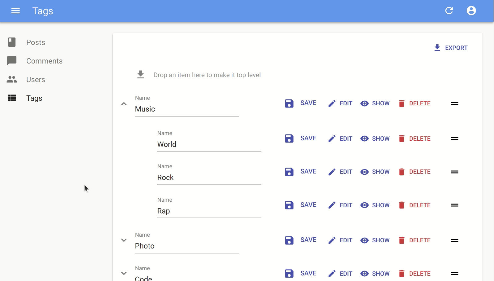

# 实验室

这个篇章参考了一些我们正在开发中的,尚未投入生产环境的项目. 他们可能缺失一些特性, 有些边界条件可能覆盖不全. 使用这些就要自己承担风险了. 同时, 我们也期待您的反馈!

## ra-tree

`ra-tree` 是一套配合tree data(树形数据)的组件. 它由2个包组成:

- `ra-tree-core`: 核心组件, 提供逻辑处理, 不涉及UI. [点击查看更多](https://github.com/marmelab/react-admin/blob/master/packages/ra-tree-core/README.md)
- `ra-tree-ui-materialui`: 依赖上面的包,提供material-ui风格的UI组件,[点击查看更多](https://github.com/marmelab/react-admin/blob/master/packages/ra-tree-ui-materialui/README.md)
